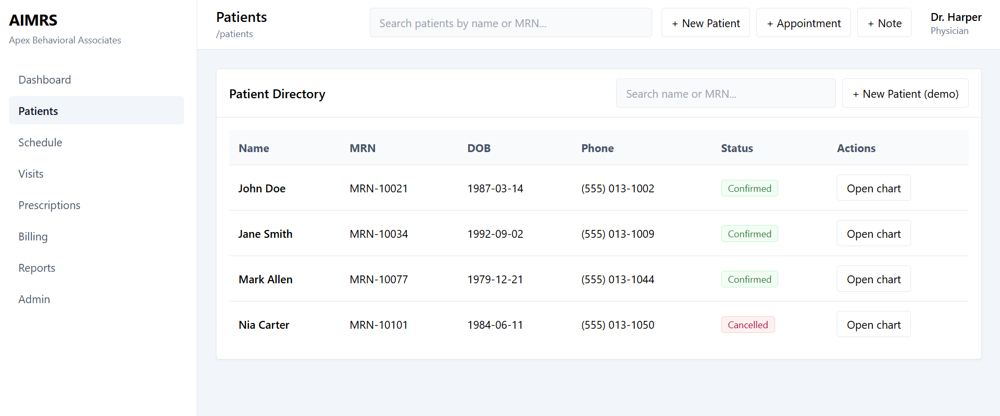
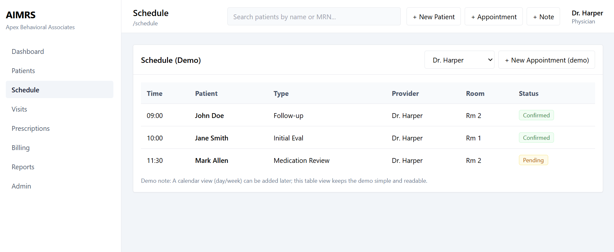
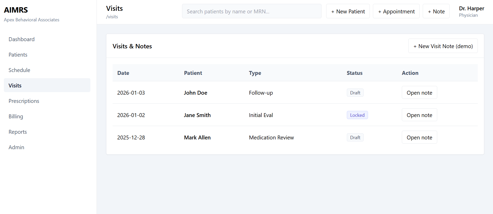
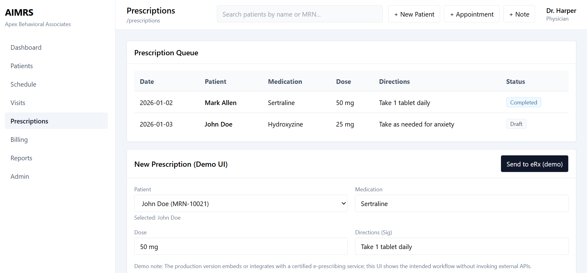
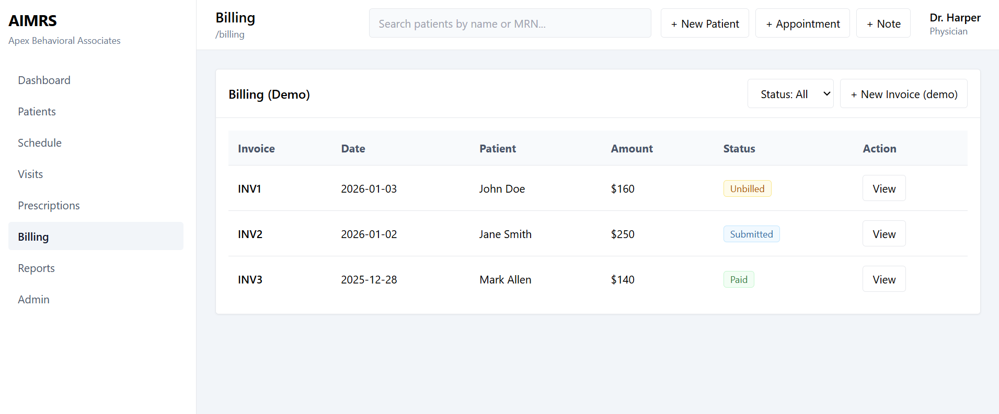

# AIMRS-demo-UI

A clickable **UI/UX prototype** for **AIMRS (Apex Integrated Medical Records System)** — designed for proposal demos and stakeholder walkthroughs.

This repo is **front-end only** (no backend, no real data, no PHI). It showcases the intended navigation and key workflows for:
- Dashboard
- Patients → Patient Chart
- Schedule
- Visits → SOAP Note (Draft/Lock)
- Prescriptions
- Billing → Invoice Detail
- Reports
- Admin

> **Demo intent:** Present the user experience and workflow design before implementing backend services.

---

## Tech Stack
- **Vite**
- **React**
- **Tailwind CSS**
- **React Router**

---

## Getting Started (Local or Codespaces)

### Install dependencies
```bash
npm install
npm run dev -- --host 0.0.0.0 --port 5173
``

###Production Demo
npm run build
npm run preview -- --host 0.0.0.0 --port 4173
```

## Screenshots

> UI-only prototype screenshots.







